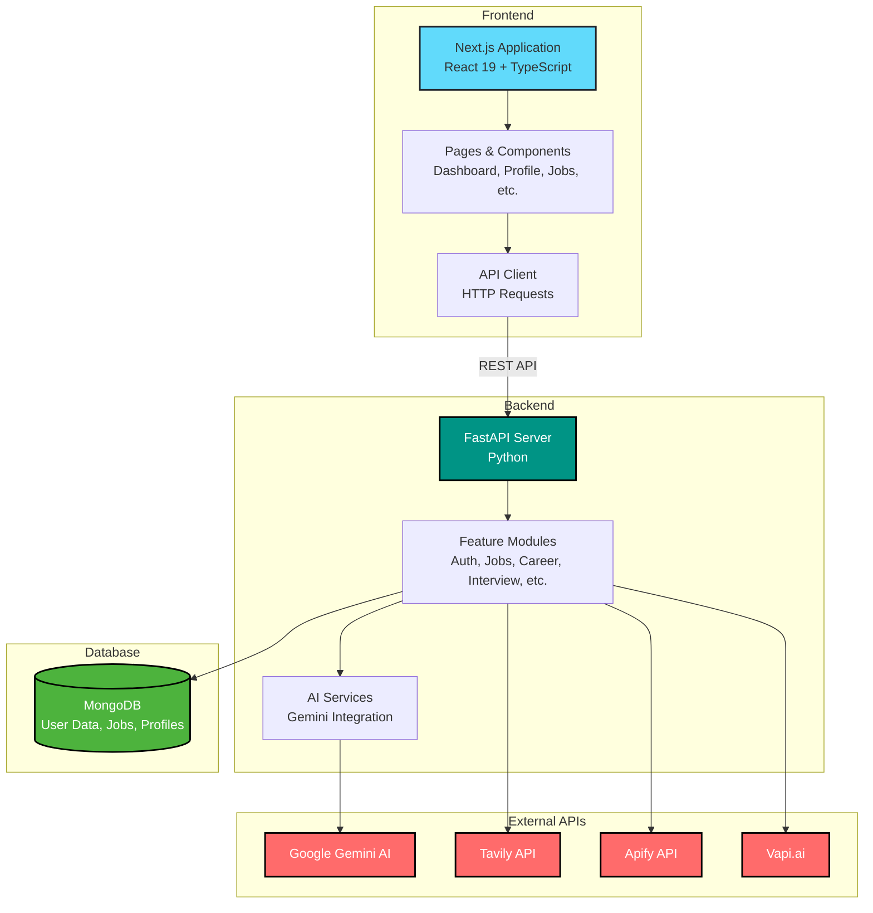

# HACKSYNC Architecture Diagram

```mermaid
graph TB
    subgraph "Frontend"
        NextJS[Next.js Application<br/>React 19 + TypeScript]
        Pages[Pages & Components<br/>Dashboard, Profile, Jobs, etc.]
        API[API Client<br/>HTTP Requests]
    end

    subgraph "Backend"
        FastAPI[FastAPI Server<br/>Python]
        Modules[Feature Modules<br/>Auth, Jobs, Career, Interview, etc.]
        Services[AI Services<br/>Gemini Integration]
    end

    subgraph "Database"
        MongoDB[(MongoDB<br/>User Data, Jobs, Profiles)]
    end

    subgraph "External APIs"
        Gemini[Google Gemini AI]
        Tavily[Tavily API]
        Apify[Apify API]
        Vapi[Vapi.ai]
    end

    NextJS --> Pages
    Pages --> API
    API -->|REST API| FastAPI
    FastAPI --> Modules
    Modules --> Services
    Modules --> MongoDB
    Services --> Gemini
    Modules --> Tavily
    Modules --> Apify
    Modules --> Vapi

    style NextJS fill:#61dafb,stroke:#20232a,stroke-width:2px
    style FastAPI fill:#009485,stroke:#000,stroke-width:2px,color:#fff
    style MongoDB fill:#4db33d,stroke:#000,stroke-width:2px,color:#fff
    style Gemini fill:#ff6b6b,stroke:#000,stroke-width:2px,color:#fff
    style Tavily fill:#ff6b6b,stroke:#000,stroke-width:2px,color:#fff
    style Apify fill:#ff6b6b,stroke:#000,stroke-width:2px,color:#fff
    style Vapi fill:#ff6b6b,stroke:#000,stroke-width:2px,color:#fff
```
